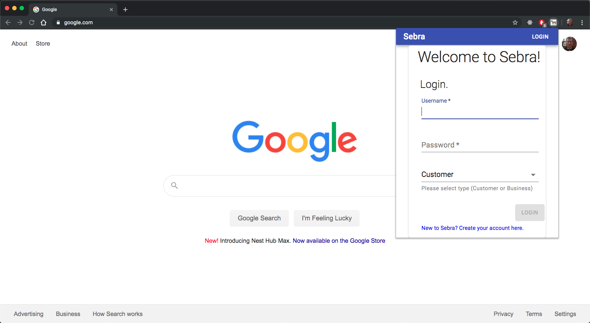

# 🦓 Libra Cryptocurrency Payment Chrome Extension

A Libra Cryptocurrency Payment app developed with the aim of creating a simple UX that allows users to make simple transactions without the complexities of dealing with public / private keys.



## Table of contents
* [Motivation](#motivation)
* [What is Libra?](#what-is-twilio?)
* [Login Credentials](#login-credentials)
* [Live Demo](#live-demo)
* [Dependencies](#dependencies)
* [Requirements](#requirements)
* [Installation](#installation)
* [Running Locally](#running-locally)
* [Tests](#tests)
* [Contact](#contact)

## Motivation

## What is Libra?
Libra is a permissioned blockchain digital currency proposed by the American social media company Facebook. The project, currency and transactions are to be managed and cryptographically entrusted to the Libra Association, a membership organization founded by Facebook's subsidiary Calibra and 27 others across payment, technology, telecommunication, online marketplace, venture capital and nonprofits. The currency and network do not yet exist, and only rudimentary experimental code has been released.[2] The launch is planned to be in 2020

## Login Credentials

## Live Demo

## Dependencies
* [React](https://reactjs.org)
* [Redux](https://redux.js.org)
* [Material-UI](https://material-ui.com/)
* [Axios](https://github.com/axios/axios)

## Requirements
* [Node.js (v10.16.0)](https://nodejs.org/en/)
* [Git](https://git-scm.com/downloads)

## Installation
Step 1: Clone Repo
```sh
git clone https://github.com/briantam23/sebra-chrome-extension.git` # or clone your own fork
```

Step 2: Install `node_modules`
```sh
npm install # or yarn install
```

## Running Locally
1. Run `npm run build` to put everything required into build folder, then launch `chrome://extensions/` in Google Chrome.
2. On the upper-right hand side of the window, make sure developer mode is on.
3. Click “Load unpacked” and open the “build” folder in this project, it should contain `index.html`, `manifest.json`, different sizes of logos, and bundled JavaScript files.
4. If you have already published a version in production and you are testing a newer version, you should also disable the production version.
5. To update the extension, run `npm build again`, and click the “Refresh” button.

## Tests

## Contributors

> [Brian Tam](https://github.com/briantam23) <br/>
> [Sydney Lai](https://github.com/sydneylai) <br/>
> [Allen Shegay](https://github.com/jnsead)